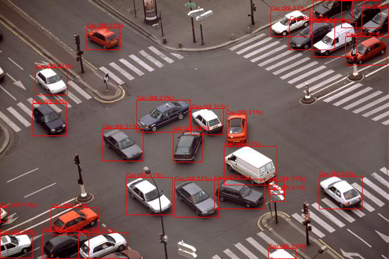
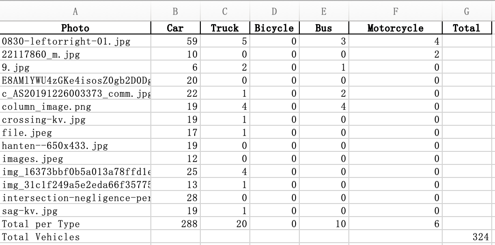
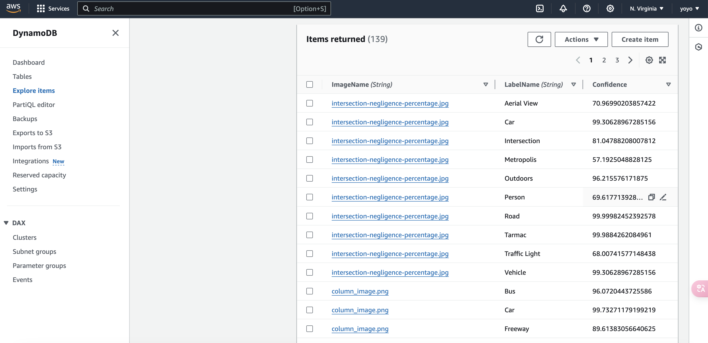
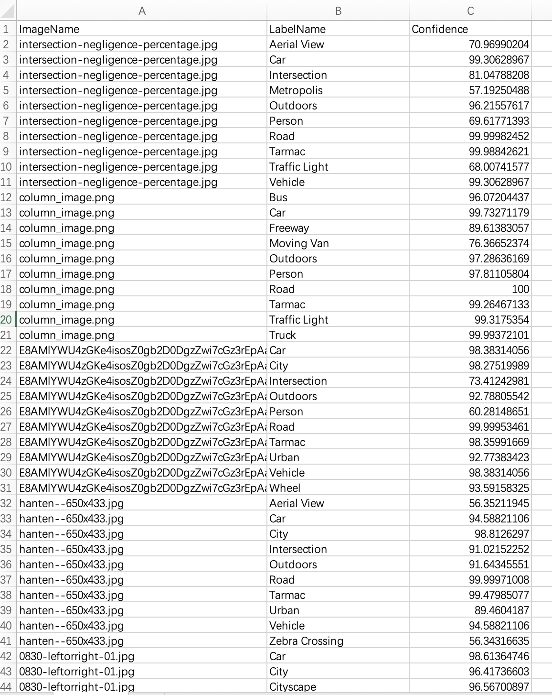

**Overview of Project** 

In order to address the issue of regular traffic volume statistics conducted by Japan’s Ministry of Land, Infrastructure, Transport and Tourism, I designed this project and provided some practical implementation methods.

Before the DX (Digital Transformation) reform, the Ministry typically used manual, fixed-point, and scheduled methods to gather traffic data. This process required significant manpower, resources, financial investment, and time. Additionally, manual statistics always carried some degree of error.

Therefore, I propose using AWS Amazon Rekognition to efficiently, affordably, and flexibly solve the above issues.

**Version 1**

1. **Overview of Version 1 ☁️**

After setting up cameras at intersections, photos are taken at regular intervals and automatically uploaded to AWS S3. Using AWS CLI, a Python script is run locally, integrated with Amazon Rekognition to perform image recognition on the vehicles in the photos. The statistical data is then generated in an Excel file locally. By reviewing the Excel file, users can directly see the total count of each vehicle type as well as the overall vehicle count.

This version is suitable for individuals who are not very familiar with IT technology or AWS operations. The staff responsible for the final statistical analysis only need to check the Excel file to obtain the information.

Disadvantage: Requires IT personnel to set up initially; provides limited information.

1. **Steps to be performed 👩‍💻**

In the next few lessons, we'll be going through the following steps.

- Creating an S3 Bucket
- Uploading images to S3
- Setting up AWS CLI
- Creating and running Python script

1. **Services Used 🛠**
- Amazon S3: For storing the images in the process of generating labels.
- Amazon Rekognition: To analyse images and generate image labels.
- AWS CLI: Interacting with AWS services through command line interface(CLI).

1. **Estimated Time & Cost ⚙️**
- This project is estimated to take about 2 hours.
- Cost: Free (When using the AWS Free Tier)

1. **Final Result**

This is what your project will look like, once built:

**Version 2**

1. **Overview of Version 2 ☁️**

After setting up cameras at intersections, photos are taken at regular intervals and automatically uploaded to AWS S3. A pre-configured Lambda function is triggered whenever a new file is uploaded to S3, integrating with Amazon Rekognition for image recognition. The recognition results, including image name, label name, and confidence level, are written into DynamoDB. Technicians can download the results in CSV format based on the information in DynamoDB and perform statistical analysis using the detailed information in the CSV. If any issues arise, the logs in CloudWatch can be reviewed.

This version is suitable for individuals with an IT background who are familiar with AWS operations. The staff responsible for the final statistical analysis can review the CSV results to obtain more detailed information.

Disadvantage: Requires some knowledge of IT and AWS operation methods.

1. **Steps to be performed 👩‍💻**

In the next few lessons, we'll be going through the following steps.

- Creating an S3 Bucket
- Creating a Lambda Function
- Setting up a DynamoDB Table
- Linking Lambda Trigger to S3
- Testing S3 to Lambda and DynamoDB Integration
- Uploading Images to S3 Bucket
- Reviewing Results in DynamoDB

1. **Services Used 🛠**
- Amazon S3: For storing the images in the process of generating labels.
- Amazon Rekognition: To analyse images and generate image labels.
- Amazon Lambda: Triggers image analysis and coordinates between S3 and Rekognition.
- Amazon DynamoDB: Stores image labels, names, and confidence scores for analysis.
- Amazon CloudWatch: Monitors and logs the entire process for troubleshooting and performance tracking.

1. **Estimated Time & Cost ⚙️**
- This project is estimated to take about 1 hour.
- Cost: Free (When using the AWS Free Tier)

1. **Final Result**

This is what your project will look like, once built:

